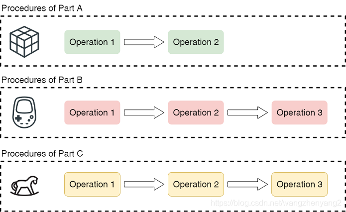
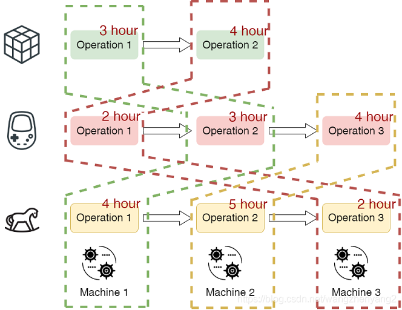
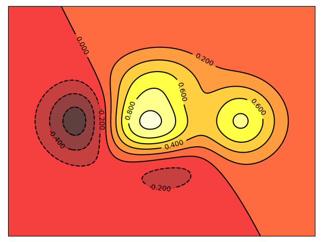

# Job Shop 问题简述

- 作业车间调度问题（Job-shop Scheduling Problem, JSP)是制造流程规划和管理中的调度难题。该问题中，一组机器需处理一组工件，每个工件由一系列具有先后顺序约束的工序形成，每个工序只需要一台机器，机器一直可用，可以一次处理一个操作而不会中断。决策内容包括如何对机器上的工序进行排序，已优化给定的性能指标。 JSP的典型性能指标是完工时间 (Makespan)，即完成所有工作所需的时间。在计算机科学中，车间作业调度问题被认为是一个非常强的NP难问题。

- 问题描述

  - 给定n个工件{J1, J2, ..., Jn}，要在m台机器{M1, M2, ..., Mm}上进行加工。每个工件的加工需要经过对应的工序{O1, O2, ..., Om}。这些操作对应要使用不同的机器。
  - 工件上的约束：每个工件上的工序只能在上一个工序执行结束后，才能开始执行下一个工序。
  - 机器上的约束：每台机器每个时刻最多只能执行一个工件，工序执行时非抢占。
  - 给定每个工件需要经过的工序，每道工序所需时间，求能最小化总加工时间(Makespan)的机器调度方案。

- 实例

  

  

# 禁忌搜索

## 算法思想

标记已经解得的局部最优解或求解过程，并在进一步的迭代中避开这些局部最优解或求解过程。局部搜索的缺点在于，太过于对某一局部区域以及其邻域的搜索，导致一叶障目。为了找到全局最优解，禁忌搜索就是对于找到的一部分局部最优解，有意识地避开它，从而或得更多的搜索区域

看图，如果我们在搜索过程中找到了一个局部的最优解，那么我们接下来的搜索要有意识地避开这朝这个解的搜索方向搜（将这个方向填入禁忌表中），这样在能够跳出局部最优的同时也获得更多的搜索区域，更能找到相对最优的解。

## 算法要素

- 解的构建：针对具体问题编码解的具体形式
- 领域移动：通过当前解来获得有效的邻居解
- 评价函数：解值，判断解的优劣程度，直接影响下一步的搜索方向
- 禁忌表：
  - 禁忌对象：禁忌表通过限制具有某种特征对象的解来限制，朝这个方向的邻居移动。与某个最优解的解相关的邻居解受限制。
  - 禁忌长度：禁忌的对象经过多少次迭代后解禁。
    - 禁忌对象和禁忌长度决定了禁忌搜索的好坏。如果禁忌对象不够准确，也即禁忌的搜索的方向不够准确或者禁忌长度过小算法避免进入局部最优的能力会受限制
    - 如果禁忌长度过大，搜索区域受到限制，就有可能跳出局部最优后无法向下一个最优前进，好的解可能会被跳过。
  - 破禁准则：对于具备某种结构或者特征的解可以藐视禁忌规则获得特赦。
- 停止准则
  - 最大迭代数，算法运行时间，给定数目的迭代内不能改进解或组合策略。

## 禁忌搜索应用于JSP

- 编码解：
  - 机器对工件的约束：对于某个机器，其存一个调度表，指定它下一个要执行的工件序号，机器对工件的序号的先后严格要求。
    - 存在死锁的问题：机器请求工件、工件请求机器，造成死锁推进不下去了，Makespan无限大。这种解无效，需要检测出死锁的发生
  - 机器对工件的优先级：对于某个机器，其存一个优先级表，不严格指定下一个工件，对于已经到达等待的机器，按照优先级选择下一个执行的工件（本项目使用的编码）
    - 这里面包含了一点贪心的做法：尽可能不让机器停机，只要等待队列中存在工件就执行
    - 问题：虽然机器尽可能不停机直观上能缩小Makespan，但并不是一定的。可能会漏掉一些可能的调度，解空间不完全，最优解可能也包含其中
    - 即便是这样，一个10*10的用例解空间的大小为（10！）^10 ≈ 4*10^65，这样的解空间已经足够搜了
  - 序列化工件的执行顺序：
    - 组内其它成员使用到的，很妙。不会死锁的同时也不会缩小解空间，更合理。
- 邻域移动
  - 邻居算子：随机选择一个机器，随机选择此机器的两个工件交换优先级值
  - 邻居个数：过小每次移动解很难改进或者改进不大，收敛过慢。过大，计算代价过大，移动过慢，收敛也会变慢。这里设置为m*n，希望每次找到的邻居每个机器，每个工件都能参与改动。
    - 也可以做实验验证邻居个数对解的影响
- 评价函数：计算当前解下的Makespan
- 禁忌表设计：
  - 禁忌对象：
    - 禁忌调整的机器/禁忌调整的工件（粗粒度）
    - 禁忌（机器-工件）的二元组（中粒度）
    - 禁忌（机器-工件1-工件2）的三元组（细粒度）
  - 禁忌长度
    - 10
    - 50
    - 100
    - 500
    - 1000
  - 破禁准则：当某个被禁忌的移动可得到优于未被禁忌的移动得到的最优邻域解和历史所得到的最优解时，算法应接受该移动，不受禁忌表的限制。确保算法能搜索到局部最优后再跳出当前解域。
- 停止准则
  - 根据实验使用到的用例的规模，10*10解空间大小（10！）^10
  - 迭代上限：100000
  - 无法改进的迭代上限：1000，找到局部最优后再给你这么长时间跳出局部最优来找下一个更优解，找不到就停机

- 算法过程

  

- 实验效果

  - 不同的禁忌表设计下的实验效果
    - 禁忌对象
      - 使用用例ft06，用例abz5
      - 细粒度每次更新力度不大，迭代得慢但是能寻到较优值
      - 粗粒度每次更新力度大，迭代得快（很快就找不到更优解了），寻到的解较次
    - 禁忌长度
      - 使用用例ft10
  - 迭代多少次后能收敛
  - 邻居个数的选取对收敛速度的影响
    - 使用用例la16
  - 一次搜索的过程，最优解的变化，收敛情况，是否寻到最优
  - 多个用例下的效果表现
    - 五个用例的最优表现
  - 确定参数后的搜索能力与局部搜索的比较
    - 解的质量
    - 寻找优值解的迭代次数
    - 搜索时长
  - 怎么动态显示搜索过程

- 不足

  - 如何停止得更合理
  - 解的编码不能包含整个解空间
  - 邻居算子，移动得步长可能过小了，在当前的编码之下这样的只交换两个工件，往往得到的解值会维持原样。

# 目录结构

JOBSHOP

> instance：用例目录
>
> > jobshop1.txt：用例库
> >
> > jobshop2.txt：用例生成代码
> >
> > ...
>
> pics：示例图片
>
> tabuSearchExp：相关实验记录
>
> JSP-tabuSearch.py：主要实现程序
>
> ganttBar.json：用来绘制甘特图的json文件

# requirements

python3

matplotlib

# 使用

终端下输入：python3 JSP-tabuSearch.py

